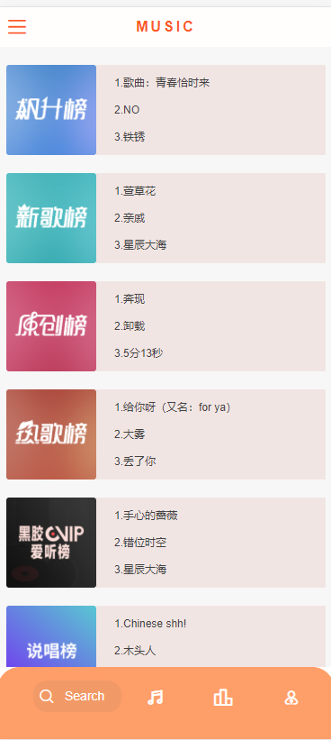
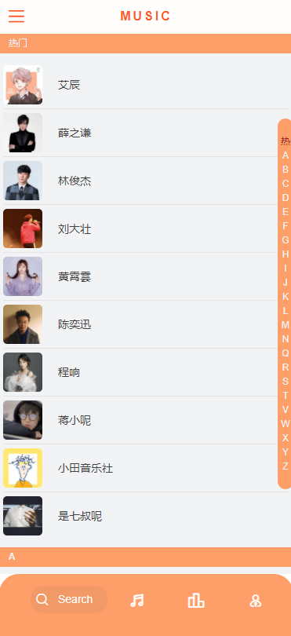
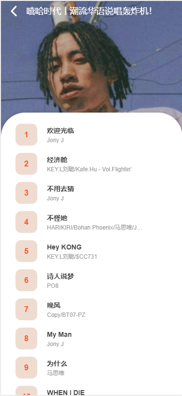
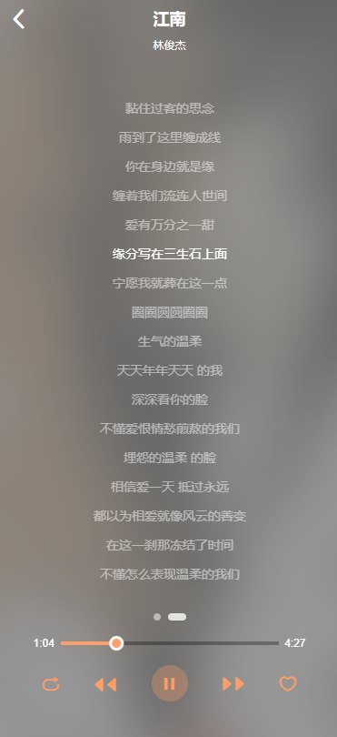
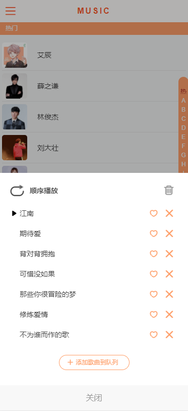
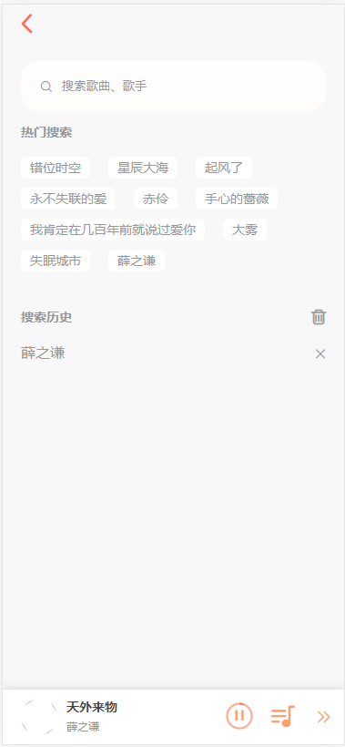
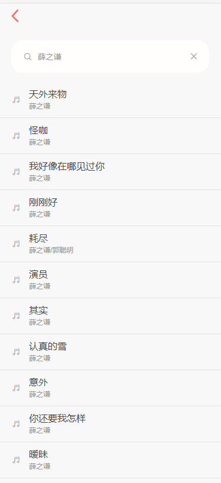
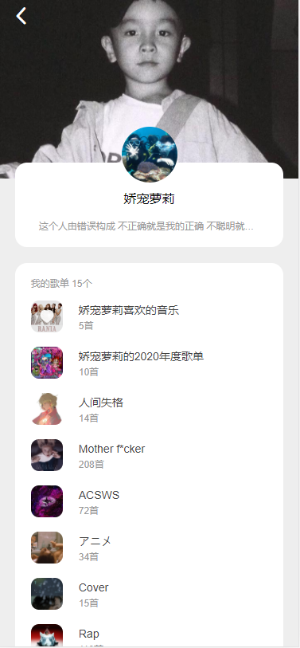
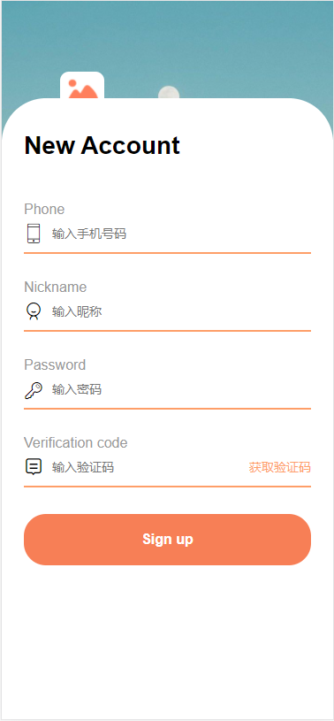

# Vue NetEasy-music

这是基于 Vue.js + vuex + vue-router + vue-axios +better-scroll + Scss + ES6 等开发一款移动端音乐 WebApp
UI 界面参考了网易云音乐以及自己的改版。

灵感来自己黄轶老师的vue-music课程，不过老师使用的是qq音乐的接口，而这个是使用的网易云音乐真实的接口。
由[Binaryify](https://github.com/Binaryify)提供的 [NeteaseCloudMusicApi](https://binaryify.github.io/NeteaseCloudMusicApi/#/?id=neteasecloudmusicapi)。

项目演示地址：[vue-NetEasy-music](http://218.244.159.175/)

- 推荐使用手机预览，电脑在 Chrome 调试模式效果更佳，开启调试模式的手机模式后，如果不能滚动，需要手动刷新一下页面

## 预览

#### 推荐、排行榜、歌手





#### 歌单详情、歌手详情




#### 播放器、播放列表





#### 搜索页面




#### 用户中心



#### 登录注册




## 开发目的

通过学习开发一个 Vue 全家桶项目，更加熟悉了解Vue，提高自己的设计，编程，独立解决问题的能力。

## 技术栈

**前端**

* `Vue`：用于构建用户界面的 MVVM 框架
* `vue-router`：为单页面应用提供的路由系统，使用了 `Lazy Loading Routes` 技术来实现异步加载优化性能
* `vuex`：Vue 集中状态管理，在多个组件共享某些状态时非常便捷
* `vue-lazyload`：实现图片懒加载，节省用户流量，优化页面加载速度
* `better-scroll`：解决移动端各种滚动场景需求的插件，使移动端滑动体验更加流畅
* `SCSS`：css 预编译处理器
* `ES6`：ECMAScript 新一代语法，模块化、解构赋值、Promise、Class 等方法非常好用

**后台**

* `Node.js`：利用 Express 搭建的本地测试服务器
* `vue-axios`：用来请求后端 API 音乐数据
* `NeteaseCloudMusicApi`：网易云音乐 NodeJS 版 API，提供音乐数据

**其他工具**

* `vue-cli`：Vue 脚手架工具，搭建项目初始环境
* `eslint`：代码风格检查工具
* `iconfont` ：阿里巴巴图标库
* `fastclick` ：消除 click 移动游览器 300ms 的延迟

## 实现功能

播放器内核、推荐页面、热榜页面、歌手页面、歌单详情、歌手详情、排行榜详情、搜索页面、播放列表、用户中心、登录注册等等功能。

### 推荐页面

推荐页分成三个部分，分别是 banner 轮播图、一排icon（没有完全实现）推荐歌单、推荐歌曲，数据都是使用 `axios` 请求 API 获取得到的，图片都使用 `vue-lazyload` 实现懒加载。

轮播图：使用 `better-scroll` 实现，具体可以看这里 [Slide](https://ustbhuangyi.github.io/better-scroll/doc/zh-hans/options-advanced.html#```snap```) 。

推荐歌单，推荐歌曲：使用 `vuex` 管理数据，方便组件之间的数据交互（播放器播放歌曲）。因为数据上还有播放数量，所以就顺便也加上去了。

### 排行榜页面

同样是通过 API 获取到排行榜的数据，但是因为 API 获取到的是排行榜中所有歌曲的数据，所以难免在加载速度上有点慢，后期再看能不能优化一下，加载的慢毕竟太影响用户体验了，别的就没什么了。

### 歌手页面

实现歌手列表的左右联动

### 歌曲列表组件

用来显示歌曲列表，在很多的地方都进行了复用，例如：歌单详情页、排行榜详情页、歌手详情页、搜索结果等等。

### 歌单详情页、排行榜详情、歌手详情

通过歌单的 ID 来获取歌单中的歌曲数据，这三个用的是同一个组件，可以根据传入的props不同选择里面不同的list样式

### 播放器

实现功能：顺序播放、单曲循环、随机播放、收藏等。

播放、暂停使用 HTML5 的 audio 实现。

数据、播放状态、播放历史、习惯歌曲等方面使用了 `vuex` 来进行管理，因为数据太多，组件直接传递的话是会死人的，所以还是老老实实的用 `vuex` 吧，数据之前的传递真的很方便。

图标使用 `iconfont` 阿里巴巴图标库，中间的唱片旋转动画使用了 `animation` 实现。

歌词部分获取到网易的歌词数据，然后使用 第三方库 [`lyric-parser`](https://github.com/ustbhuangyi/lyric-parser) 进行处理。实现显示歌词、拖动进度条歌词同步滚动、歌词跟随歌曲进度高亮。

通过 `localstorage` 存储喜欢歌曲、播放历史数据。


### 播放列表

显示和管理当前播放歌曲，可以用来删除列表中的歌曲、以及选择播放歌曲。

### 搜索功能

实现功能：搜索歌手、歌单、歌曲、热门搜索、数据节流、上拉刷新、保存搜索记录。

通过关键字请求 API 获取搜索数据，显示歌手、歌单、歌曲。

实现了上刷新，因为搜索可以设置请求数据的条数，所以可以用来实现上刷新的功能。

通过节流函数实现数据节流，通过 `localstorage` 存储搜索数据。

### 用户中心

调用接口，获取登录用户的歌单，个人资料等信息，后续会增加更多功能

## TODO

1. 首页日推等一系列功能
2. 优化重复代码
3. 歌单操作,收藏添加等
4. 增加电台 功能

## Build Setup
代码下到本地之后，需要运行NetEasy接口。


```bash
# install dependencies
npm install

# serve with hot reload at localhost:8080
npm run serve

# build for production with minification
npm run build
```
